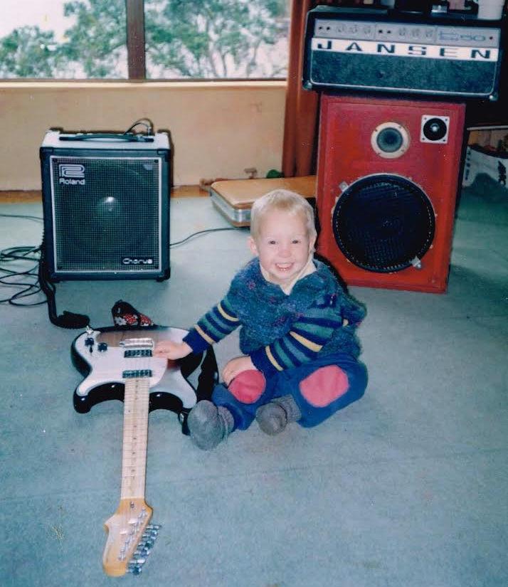
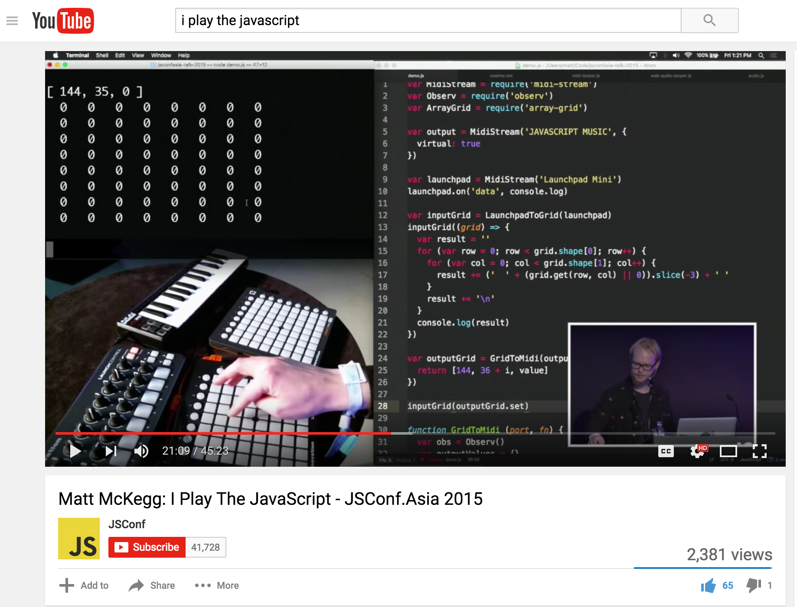
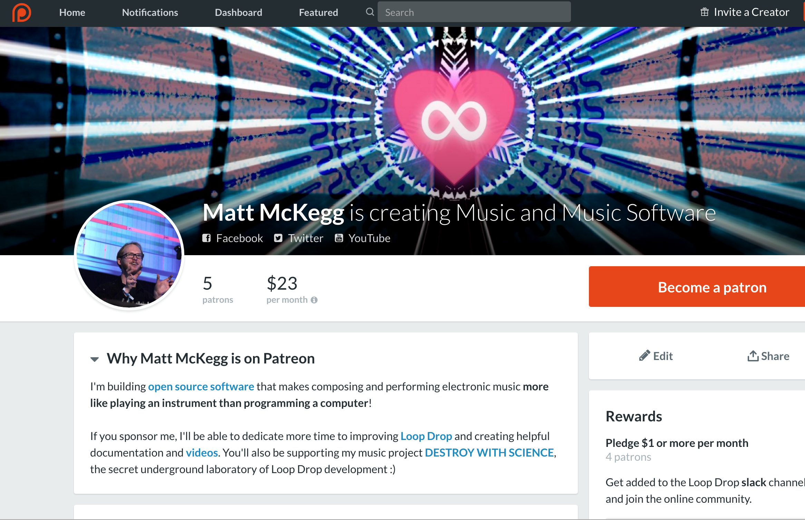

I Play the JavaScript
===

with [@MattMcKegg](https://twitter.com/MattMcKegg)

# I make **music** with **computers**.

# I also make **_software_** to make **music** with **computers**.

## **Loop Drop** — loopjs.com

>> [Play some tunes](https://www.youtube.com/watch?v=5zutWpFG8pk) and give a quick overview of how it works.

>> Sample the audience and make a song!

## Loop Drop is **JavaScript**!

> Loop Drop is a desktop application that you can install on your computer. But it is actually 100% JavaScript! This is achieved using Electron (made by Github), which combines Node.js with Chromium giving you everything you'd ever want!

Electron - **Chromium + Node.js**

http://electron.atom.io

# So how did this happen?

> Normally I talk about some of the technology behind Loop Drop, electron, or web audio. But today I'm going to try sharing a much more personal story.

> I am not a trained musician. I did attend drum lessons for a few weeks when I was about 8, before running away and refusing to attend ever again. My family travelled a lot, and lived in a caravan, so the drum kit I played was actually a Roland SPD-8.

## 

## My first **drumkit**

> https://www.youtube.com/watch?v=t0MSO12k-Is

> This thing was a wonder of 1980s music technology.

## My first **DAW**

> I spent the last few years of school mostly just messing around and making music with my friends. We were using "demo" versions of FL Studio.

## My first **album**

> I had made a bunch of songs mostly just experimenting with what sounds you could make. There was a whole online community of bedroom tinkerers making music using their computers. There was a lot of friendly competition. We'd make stuff and upload it and see what others thought. And very subjectively critique each other.

> I took a bunch of these songs, and released them as an album on a website I made in photoshop. It was a free download. Next minute, some music blog wrote about it, and I started getting hundreds of hits.

### A little bit **internet famous**.

> I started to receive fan mail from people all around the world. At first it was "Wow love your music", and then it was all "Come play at our university!"

# But how do you play computer music **live**?

> For most bands and musicians this is not a problem. If you are a guitarist, it makes no difference whether you are playing on stage or recording in a studio. In both cases, you are playing the guitar. In most cases with music, the album is just a recording of what the musicians would do anyway. The great thing about this is the musician can intuitively pick up on the feeling in the room and change the way the are playing to accommodate this. They might not even notice they're doing it. There is this amazing feeling that comes from a band jamming with each other, and vibing off the audience.

> But this is not the case with most computer music. I was creating music on a timeline.

### **Painted**, not played.

> This leaves only a few options.

## Recruit a bunch of musicians and **play it for real**!

> This is actually something that would be a lot of fun, but it is not representative of my musical process. I'd be doing completely different things in the studio to what I'm doing on stage. It would be treating the album like a score, things would get very complicated very quick with the amount of sounds I use.

## **DJ it!** (_just press play..._)

> The performance would be more like an exhibition, much like how a painter would present their work. But I don't find this very fun. I want to perform, share and be in the moment with the audience, able to easily adapt to the room vibe. Not just a boring and predictable exhibit.

## Play **everything** yourself!

> https://www.youtube.com/watch?v=iHSMnWpyIeM

> This was the option I wanted to go with. But my songs are already sequenced. How to go about destructuring and playing?

> I had this crazy idea that I'd take my existing songs, and learn how to play all the individual parts and then build them up one loop at a time.

### **Recording anxiety**

> I suffer from acute recording anxiety. This was always a problem. I’d be jamming away a cool riff, and it sounds awesome, then I hit record and my figures turn to jelly, and it comes out all wrong. I looked long and hard for a solution, but couldn't find anything reliable. It was time to build my own solution.

## **Time travel** with Node.js

> I created a Node.js script that allowed me more control over input, storing all MIDI in a buffer, and then allowing me to go back in time and create loops after I played them, along with some realtime loop transform controls.

> In the process of trying to learn my songs, and failing kind of miserably, I managed to develop a lot of the core looping concepts that still exist in Loop Drop today.

### JSConf.asia

``youtu.be/NL0nb8A8FDM``

## **But wait, there's** (so much) **more!**

Why stop at **MIDI**, what about **audio** too?

> There were a lot of other things that I found frustrating about my workflow, such as switching songs, and linking of params. I thought maybe I could have a go solving them with Web Audio. This was probably a terrible idea. Once you take control of the sound, things suddenly get very responsible. At first I was just sampling, then I started messing around with synthesis.

## But it _still wasn't good enough_.

> I couldn't play my songs. No matter how hard I tried to learn them. I'd end up getting distracted while testing and accidentally creating new songs by jamming. But this was a lot of fun. In fact much more fun than trying to play my stupid old songs. I hooked up an audio recorder, and just started playing. I would then edit the songs up a bit (trim the crappy bits out), add more instruments, but they were coming from a whole new place. From an actual performance.

## **A new way to play**

_"One true version"_ no more!

> I had stumbled on a whole new way to play. Rather than having the “one true version” of a song, they become more like collections of ideas, moments. My performances took on a major improvisatory quality. I realised I could make “my studio process” and my “live performance” the same thing after all, but I'd have to change my studio process.

### My **studio process** and my **live performance** can be the **_same thing_**

> At this point I added “preroll audio recording”, which meant that Loop Drop was always recording the master output of everything you play — all you have to do is hit save. I recorded an entire album this way. It was such a refreshing change from the traditional electronic music production style where you slave over every teeny detail in a DAW. And it also means I already have my live sets ready to go!

## Good music is **subjective**.

Music is **consumed intuitively**, so it should be **created intuitively**.

> Therefore it is very difficult to create "good" music scientifically. I've come to believe that since music is consumed by your intuition, it should also be created by it. The best instruments bypass the analytical mind and connect directly to the intuition.

# "I'd buy that!"

> I started to show other people what I'd been tinkering with. I kept getting the same reply, "this is awesome, you should sell it!"

> So I launched a website. It had a great big buy now button at the top, which after entering your PayPal details, would let you use it straight away. I still had the source code up on GitHub and quietly linked to it at the bottom. I basically gave folks the option of committing code or giving me cash.

## **Download only!**

> Even though Loop Drop was entirely JavaScript and web tech, I decided not to make it an online website. It would be Electron only. This let me do some pretty cool stuff such as storing files directly on the user's hard-drive.

> I'm just not interested in running a cloud based startup.

> Software puts the user back in control. If I stop making loop drop, it doesn't just stop working.

## **Full time!**

> I took some time off work and attempted to work on Loop Drop full time, crunching those issues, pushing that code. But I started to find my productivity levels actually dropping, and my stress levels rising.

> I was actually getting more done on Loop Drop when I was working on other things.

# **STRESS!!**

> Selling Loop Drop was causing me a lot of unnecessarily stress. First of all, basically no one was buying it (possibly a relief). But there were serious performance issues, and I felt like I was making all these promises. There were issues I just couldn't fix (thanks to Web Audio bugs).

## Should I **de-open source** it?

> I created a whole plan where I would close up the source code, and instead create a more generic loopjs platform that would be better. Maybe this would drive sales? Sounded like a lot of work.

## I started to hate it :(

> Why was I doing this again?

> Weeks would go by, and I wasn't making music, I was just **attempting** to fix stupid bugs and write code.

## **Rabbit Holes of Sadness.**

> In all my attempts to solve my music problems, I had just created for myself a massive Rabbit Hole of sadness.

# But I want to **play music**, not **write software**!

> So I got my job back, and set myself a goal to play music every day!

> But them the strangest thing happened, I actually started writing code again. All these new features finally got implemented.

## **Stop writing code.** Start solving problems.

It's unexpectedly productive.

> Turns out I was way more productive solving my own problems as they came up, rather than feature lists and issues.

> Something else I realised: The few sales I was making was actually to people who could have used the open source version, they just wanted to support me.

## Patreon

Like **Kick Starter**, but for **ongoing projects**!

> So I decided to scrap the price tag, and instead experiment with recurring donations through Patreon instead.

# **Things I've learnt.**

**HOBBY CODE PROJECTS 101**

## **Avoid responsibility.**

Do it for **yourself**!

> If you want your project to remain fun and inspiring, don't make a bunch of commitments and promises. Make sure you keep doing it for yourself.

> I chose to make loop drop desktop only so I don't have to support online software, etc. I stopped charging because this caused me stress that I did not need to deal with.

**Open Source** can work. But only if you're **using it yourself**.

## Coding is **_stressful_**.

Avoid writing code as much as possible.

> Stress is useful sometimes, but a permanent state of stress is incredibly destructive. Avoid it where possible. Use it to solve motivated problems.

> Start every dev session by using your tool. First thing that bugs you, fix it! Keeps me motivated and focused. Never have to force myself.

## Look out for the **rabbit holes of sadness**.

**Identify early.** Get out while you can.

> You need to know when to stop. It can feel like your making progress, but you're just likely to get lost.

## Choose the **_right_ abstractions**.

> There is an age old debate between simple and easy.

**Simple** is _better_.

> Make sure you understand how they work, so when they break, you know how to fix them.

## Keep your code **modular**.

**Black boxes of shame** are okay.

> Things don't have to be perfect, they just have to be manageable. Don't rewrite until you have to, but if you keep it modular, this becomes much easier. You won't have to rewrite everything at once.

## **Copy** and **paste** works great!

**DRY** code can be a bit **flakey**.

> Some advantages are it becomes harder to accidentally break stuff. In open source it becomes easier to tinker. Once you become absolutely sick of maintaining multiple implementations, then it might be time to figure out an abstraction.

> Duplicate first. Once things become difficult to maintain, or too large, split out function into your lib. Only split out into it's own package once this happens across projects.

## **Optimize** for **human**.

> Focus on solving individual problems. Don't focus on being the next big thing. If it happens, it happens. But at least in the meantime, you've made your own life better.

> It has been a co-evolution — me and my tool. I continue to tweak my code as I encounter issues / have new ideas, and those changes inform new ideas in a crazy cycle of inspiration! As it stands now, there is no way that I could go back.

> Web Audio has allowed me to discover a much more enjoyable music process, and gives my complete control over the direction I go.

# Still trying to figure out **documentation**.

> People are finally starting to notice loop drop. Problem is, they go to start trying to use it, and they don't know how to start.

# DESTROY WITH SCIENCE

Loop Drop R&D **super secret\*** laboratory!

- soundcloud.com/destroy-with-science
- destroywithscience.bandcamp.com/album/droptivist

# Contributing

- github.com/mmckegg/loop-drop-app
- patreon.com/MattMcKegg

# **Web Audio School** Workshop

Keen to start building your own Web Audio projects?

https://github.com/mmckegg/web-audio-school

# Thanks for listening!

If you have questions, _come talk to me_! Or tweet [**_@MattMcKegg_**](http://twitter.com/MattMcKegg).

- loopjs.com
- github.com/mmckegg
- destroywithscience.bandcamp.com
- soundcloud.com/destroy-with-science
